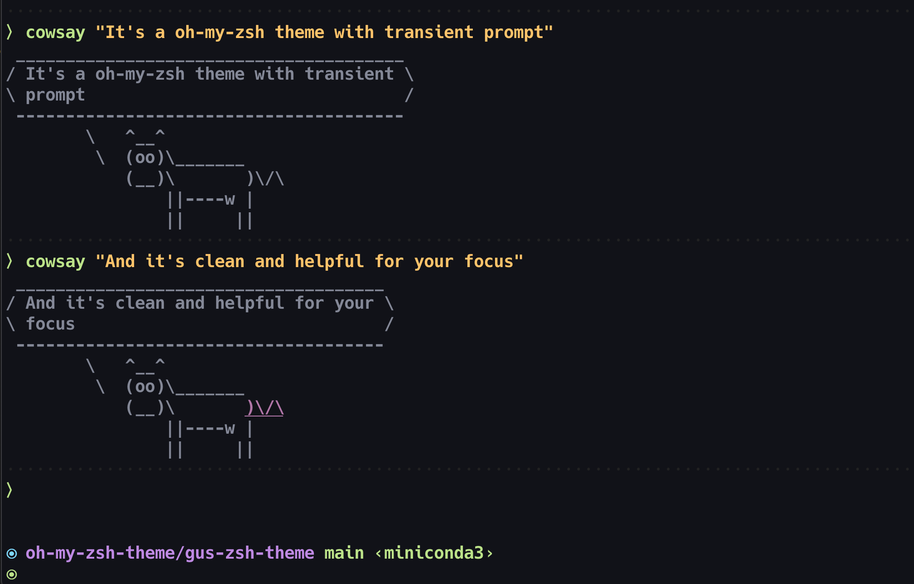

Hackable OH-MY-ZSH theme with transient prompt. 

## Usage

copy [the theme file](./gus_zsh_theme.zsh-theme) to your oh-my-zsh theme folder(normally that would be `~/.oh-my-zsh/themes`), then enable this theme in `~/.zshrc` with command `ZSH_THEME="gus_zsh_theme"`